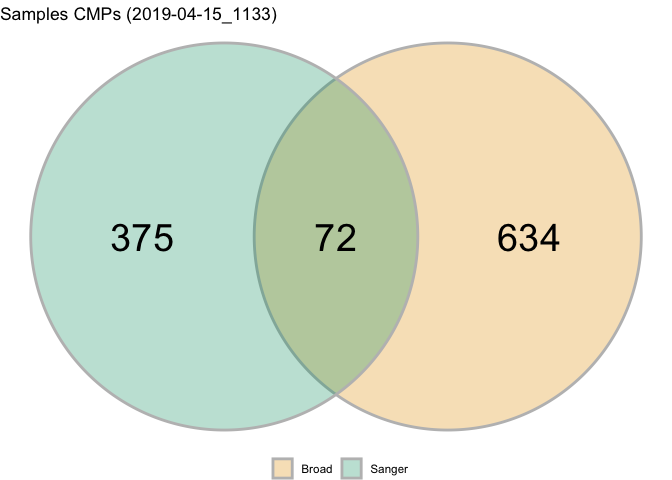
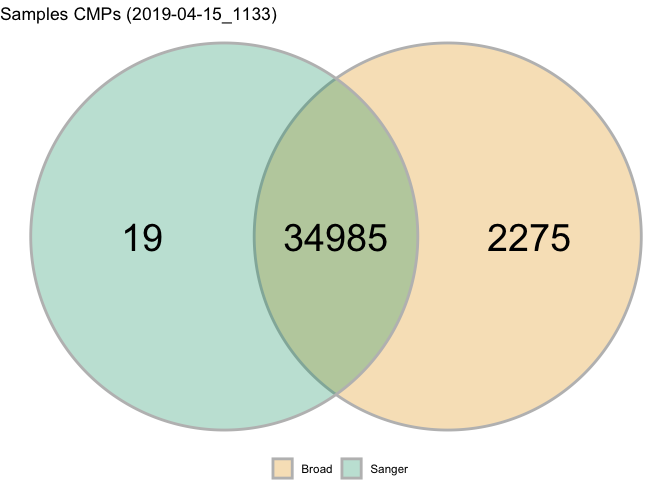
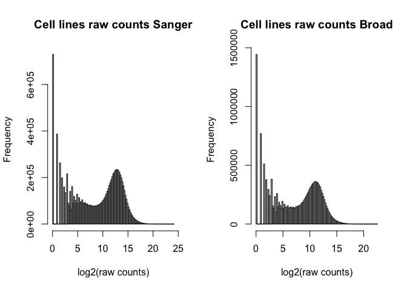
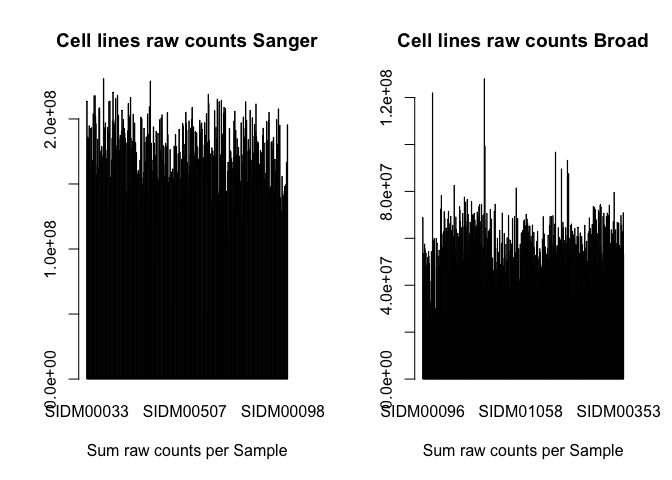
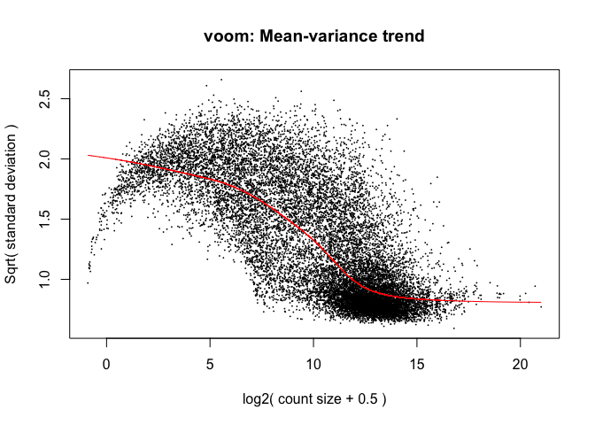
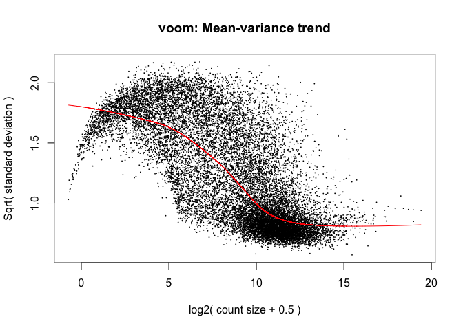
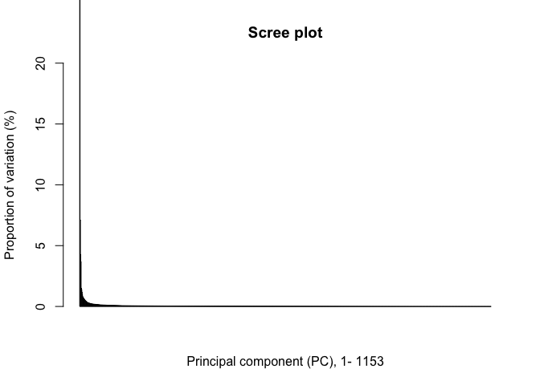
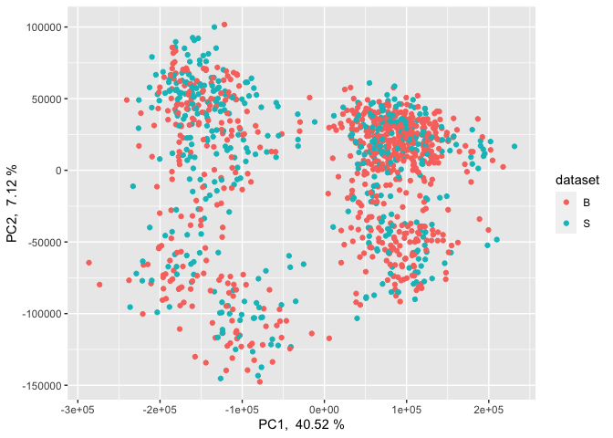
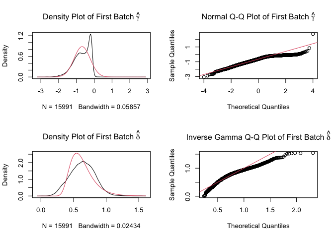
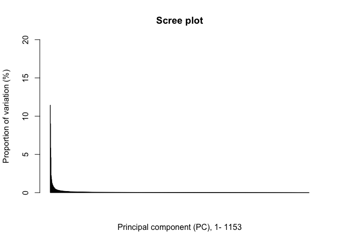

Process RNAseq cell lines from Cell Model Passports (CMP)
================
Rosa Hernansaiz-Ballesteros

### License Info

This program is free software: you can redistribute it and/or modify it
under the terms of the GNU General Public License as published by the
Free Software Foundation, either version 3 of the License, or (at your
option) any later version.

This program is distributed in the hope that it will be useful, but
WITHOUT ANY WARRANTY; without even the implied warranty of
MERCHANTABILITY or FITNESS FOR A PARTICULAR PURPOSE. See the GNU General
Public License for more details.

Please check <http://www.gnu.org/licenses/>.

## Overview

github repo: saezlab/process\_rnaseq\_cellines

Data downloaded from:
<https://cellmodelpassports.sanger.ac.uk/downloads>

RNAseq data (version): rnaseq\_2019-04-15\_1133.csv.gz Read counts and
FPKM-values provided as processed by iRAP pipeline

Steps followed to process the RNAseq:

1.  Loading data, matrix extraction and exploratory analysis of raw data

2.  Removing samples with unknown tissue

3.  Imputing 0 to NA values

4.  Removing non-expressed genes with average CPM \<=0

5.  Normalization through TMM method

6.  Voom transformation

7.  Batch correction of voom transformed data using ComBat

8.  Merging duplicates with the mean

## Getting Started

``` r
library(data.table)
library(dplyr)
library(stringr)
library(limma)
library(sva)
library(edgeR)

library(ggplot2)
library(ggforce)
library(ggfortify)

# raw data
metasample = '../../../00-CMP/metadata/model_list_2019-04-04_0916.csv' #metainformation about the cell lines
rnadata = '../../../00-CMP/expression/rnaseq_2019-04-15_1133.csv'#RNAseq file of cell lines

###### Loading datasets ######
  
cmpRAW <- data.table::fread(rnadata, sep = ',')

metaSMP <- utils::read.delim(metasample, sep = ',')
```

## 1\. Matrix extraction

Create a matrix Gene x Sample. As the original dataset from Cell Model
Pasports contains samples from 2 different sources (Sanger and Broad),
the samples are separarated based on the source, as they have different
number of genes.

``` r
models <- unique(cmpRAW$model_id) #unique samples

EXP_rawcounts = NULL
#pb <- txtProgressBar(min = 0, max = length(models), style = 3) # create progress bar
for (i in 1:length(models)) { #for each of the unique samples
#  setTxtProgressBar(pb, i) #update progress bar
  model <- models[i]
  df <-  cmpRAW[which(cmpRAW$model_id==model),c('gene_id','read_count', 'dataset_name')] #get the relevant information
  dset <- unique(df$dataset_name)
  for(institute in dset){
    dfsub <- df[which(df$dataset_name==institute),c('gene_id', 'read_count')]
    colnames(dfsub) <- c('gene_id', model)
    if(is.null(EXP_rawcounts[[institute]])){
      EXP_rawcounts[[institute]] <- dfsub
    }else{
      EXP_rawcounts[[institute]] <- merge(EXP_rawcounts[[institute]],dfsub, by = 'gene_id')
    }
  }
}
#close(pb)

rm(pb, df, dfsub, i, dset, institute, model)
```

    ## Warning in rm(pb, df, dfsub, i, dset, institute, model): object 'pb' not found

``` r
# transforming data.table to data.frame 
names(EXP_rawcounts) <- gsub("Sanger RNASeq", 'sanger', names(EXP_rawcounts))
names(EXP_rawcounts) <- gsub("Broad \\(CCLE\\) RNASeq", 'broad', names(EXP_rawcounts))

EXP_rawcounts[['sanger']] <- data.table::setDF(EXP_rawcounts[['sanger']], rownames=EXP_rawcounts[['sanger']]$gene_id)
EXP_rawcounts[['sanger']] <- EXP_rawcounts[['sanger']][,-1]

EXP_rawcounts[['broad']] <- data.table::setDF(EXP_rawcounts[['broad']], rownames=EXP_rawcounts[['broad']]$gene_id)
EXP_rawcounts[['broad']] <- EXP_rawcounts[['broad']][,-1]

# saveRDS(EXP_rawcounts, file = '1907_release1904/rnaseq_2019-06-26_geneVSmodel_list.rds')
# EXP_rawcounts <- readRDS('1907_release1904/rnaseq_2019-06-26_geneVSmodel_list.rds')

print(lapply(EXP_rawcounts, dim))
```

    ## $sanger
    ## [1] 35004   447
    ## 
    ## $broad
    ## [1] 37260   706

``` r
#### Exploration of data

gg.venn <- data.frame(x = c(-0.866, 0.866),
                      y = c(0, 0),
                      labels = c('Sanger', 'Broad'))

gg.data.samples <- list(shared = intersect(colnames(EXP_rawcounts$sanger), colnames(EXP_rawcounts$broad)),
                        sanger = as.character(colnames(EXP_rawcounts$sanger) [ which( !colnames(EXP_rawcounts$sanger)%in%colnames(EXP_rawcounts$broad) ) ]),
                        broad = as.character(colnames(EXP_rawcounts$broad) [ which( !colnames(EXP_rawcounts$broad)%in%colnames(EXP_rawcounts$sanger) ) ]) )


gg.sample <- as.data.frame(matrix(data=NA, nrow=3, ncol = 4, dimnames = list(NULL, c('label', 'x', 'y', 'count'))), stringsAsFactors = F)
gg.sample$label <- c('shared', 'Sanger', 'Broad')
gg.sample$x <- c(0, -1.5, 1.5)
gg.sample$y <- c(0, 0, 0)
gg.sample$count <- c(length(gg.data.samples$shared), length(gg.data.samples$sanger), length(gg.data.samples$broad))


gg.data.genes <- list(shared = intersect(rownames(EXP_rawcounts$sanger), rownames(EXP_rawcounts$broad)),
                        sanger = as.character(rownames(EXP_rawcounts$sanger) [ which( !rownames(EXP_rawcounts$sanger)%in%rownames(EXP_rawcounts$broad) ) ]),
                        broad = as.character(rownames(EXP_rawcounts$broad) [ which( !rownames(EXP_rawcounts$broad)%in%rownames(EXP_rawcounts$sanger) ) ]) )


gg.genes <- as.data.frame(matrix(data=NA, nrow=3, ncol = 4, dimnames = list(NULL, c('label', 'x', 'y', 'count'))), stringsAsFactors = F)
gg.genes$label <- c('shared', 'Sanger', 'Broad')
gg.genes$x <- c(0, -1.5, 1.5)
gg.genes$y <- c(0, 0, 0)
gg.genes$count <- c(length(gg.data.genes$shared), length(gg.data.genes$sanger), length(gg.data.genes$broad))

ggplot(gg.venn, aes(x0 = x, y0 = y, r = 1.5, fill = labels)) +
  geom_circle(alpha = .3, size = 1, colour = 'grey') +
  coord_fixed() +
  labs(fill = NULL) +
  theme_void() + theme(legend.position = 'bottom') +
  annotate("text", x = gg.sample$x, y = gg.sample$y, label = gg.sample$count , size = 10) +
  ggtitle('Samples CMPs (2019-04-15_1133)') + 
  scale_fill_manual(values = c('#E69F00', '#009E73',  '#0072B2'))
```

<!-- -->

``` r
ggplot(gg.venn, aes(x0 = x, y0 = y, r = 1.5, fill = labels)) +
  geom_circle(alpha = .3, size = 1, colour = 'grey') +
  coord_fixed() +
  labs(fill = NULL) +
  theme_void() + theme(legend.position = 'bottom') +
  annotate("text", x = gg.genes$x, y = gg.genes$y, label = gg.genes$count , size = 10) +
  ggtitle('Samples CMPs (2019-04-15_1133)') + 
  scale_fill_manual(values = c('#E69F00', '#009E73',  '#0072B2'))
```

<!-- -->

The next steps of the pipleline can be run either by merging the shared
samples, or by treating them separately until the normalization phase.
The raw counts distribution and the sequencing depth is different
between both datasets, so they will be merge after the
normalitation.

``` r
#### Exploratory analysis of the raw counts distribution and the sequencing depth ####

# Raw counts distribution

par(mfrow = c(1,2))
hist(log2(as.numeric(unlist(EXP_rawcounts[['sanger']]))), breaks = 100, main = 'Cell lines raw counts Sanger', xlab = 'log2(raw counts)')
hist(log2(as.numeric(unlist(EXP_rawcounts[['broad']]))), breaks = 100, main = 'Cell lines raw counts Broad', xlab = 'log2(raw counts)')
```

<!-- -->

``` r
# Sequencing Depth

par(mfrow = c(1,2))
barplot(colSums(EXP_rawcounts$sanger), main = 'Cell lines raw counts Sanger', xlab = 'Sum raw counts per Sample')
barplot(colSums(EXP_rawcounts$broad), main = 'Cell lines raw counts Broad', xlab = 'Sum raw counts per Sample')
```

<!-- -->

## 2 and 3. Removing samples with unknown tissue and NA imputing value

There are no samples with unknown tissue or with NA values.

``` r
#message('Remove samples with unknown tissue\n')
tissue = unique(metaSMP$tissue)
samples = intersect(unique(c(colnames(EXP_rawcounts[['sanger']]), colnames(EXP_rawcounts[['broad']]))),  
                    metaSMP$model_id[ which(metaSMP$tissue %in% tissue) ])
EXP_rawcounts <- lapply(EXP_rawcounts, function(EXP){EXP[ , colnames(EXP) %in% samples ]})

#message('Imputing NA (ZEROmethod) \n')
#Therea are none for this dataset
exp_na <- lapply(EXP_rawcounts, function(EXP){# save gene:sample pairs that are NAs
                index <- which(is.na(EXP), arr.ind=T)
                paste(rownames(EXP)[index[,'row']],  colnames(EXP)[index[,'col']], sep=':')
          })
if ( !is.null(do.call(c,lapply(exp_na,dim))) ){
  EXP_rawcounts <- lapply(EXP_rawcounts, function(EXP){EXP[ which(is.na(EXP)) ] = 0})
}

cat('Total genes and cell lines: \n')
```

    ## Total genes and cell lines:

``` r
print(lapply(EXP_rawcounts, dim))
```

    ## $sanger
    ## [1] 35004   447
    ## 
    ## $broad
    ## [1] 37260   706

## 4\. Removing non-expressed genes with average CPM \<=0.

The limma-voom method assumes that rows with zero or very low counts
have been removed

``` r
exp.zero <- lapply(EXP_rawcounts, function(EXP){
  index = aveLogCPM(EXP) <= 0
  rownames(EXP)[index]
})

# saveRDS(exp.zero, file = '1907_release1904/rnaseq_2019-06-26_expZero_list.rds')
# exp.zero <- readRDS(file = '1907_release1904/rnaseq_2019-06-26_expZero_list.rds')

EXP_rawcounts <- lapply(EXP_rawcounts, function(EXP){
  keep = aveLogCPM(EXP) > 0
  EXP [ keep, ]
})

cat('Total genes and cell lines: \n')
```

    ## Total genes and cell lines:

``` r
print(lapply(EXP_rawcounts, dim))
```

    ## $sanger
    ## [1] 16492   447
    ## 
    ## $broad
    ## [1] 16634   706

``` r
# saveRDS(EXP_rawcounts, file = '1907_release1904/rnaseq_2019-06-26_rmZeroGenes_list.rds')
# EXP_rawcounts <- readRDS(file = '1907_release1904/rnaseq_2019-06-26_rmZeroGenes_list.rds')
```

## 5 and 6. Normalization through TMM method and Voom transformation

Although it is also possible to give a matrix of counts directly to voom
without TMM normalization, limma package reommends it. **TMM** is the
weighted trimmed mean of M-values (to the reference) proposed by
Robinson and Oshlack (2010), where the weights are from the delta method
on Binomial data. If refColumn is unspecified, the library whose upper
quartile is closest to the mean upper quartile is
used.

``` r
EXP_rawcounts = lapply(EXP_rawcounts, function(EXP){DGEList(counts=EXP,genes=rownames(EXP))})
EXP_normcounts = lapply(EXP_rawcounts, function(EXP){calcNormFactors(EXP, method = 'TMM')})
# saveRDS(EXP_normcounts, file = '1907_release1904/rnaseq_2019-06-26_tmm_norm_list.rds')
# EXP_normcounts <- readRDS(file = 'rnaseq_2019-06-26_tmm_norm_list.rds')

EXP_voom = lapply(EXP_normcounts, function(EXP){voom(EXP, plot = T)$E}) # $E extract the "data corrected for variance"
```

<!-- --><!-- -->

## 7\. Batch correction of voom transformed data using ComBat.

We use “tisue” and duplicates as
covariates

``` r
# join all samples in a matrix. Samples and Genes from the different sets are labeled with S or B respectively.
genes = Reduce(intersect, list(rownames(EXP_voom$sanger), rownames(EXP_voom$broad)))

tmp <- lapply(EXP_voom, function(EXP, genes){
  EXP <- as.data.frame(cbind(genes=rownames(EXP), EXP),stringsAsFactors=F)
  EXP[ genes, ]},genes)

cat('Total genes and cell lines: \n')
```

    ## Total genes and cell lines:

``` r
print(lapply(tmp, dim))
```

    ## $sanger
    ## [1] 15991   448
    ## 
    ## $broad
    ## [1] 15991   707

``` r
colnames(tmp$sanger) = paste0('S.',colnames(tmp$sanger))
colnames(tmp$broad) = paste0('B.',colnames(tmp$broad))

EXP <- merge(tmp$sanger, tmp$broad, by.x = 'S.genes', by.y = 'B.genes', row)
rownames(EXP) <- EXP$S.genes
EXP <- EXP[,2:ncol(EXP)]
EXP <- data.matrix(EXP, rownames.force = T)

cat('Total genes and cell lines:', dim(EXP), '\n')
```

    ## Total genes and cell lines: 15991 1153

``` r
## variables
catgroup <- as.data.frame(cbind(id=colnames(EXP),sample=gsub('[S/B]\\.','',colnames(EXP)),dataset=substr(colnames(EXP),1,1)),stringsAsFactors = F)
catgroup <- merge(catgroup, metaSMP[,c("model_id","tissue","tissue_status", "cancer_type")], by.x='sample', by.y='model_id')
catgroup <- catgroup[,-1]

## PCA

exp.pca <- prcomp(t(EXP))
str(exp.pca)
```

    ## List of 5
    ##  $ sdev    : num [1:1153] 120019 50325 38940 36274 23035 ...
    ##  $ rotation: num [1:15991, 1:1153] -0.002956 -0.000667 -0.00242 -0.000886 -0.004396 ...
    ##   ..- attr(*, "dimnames")=List of 2
    ##   .. ..$ : chr [1:15991] "SIDG00002" "SIDG00003" "SIDG00004" "SIDG00006" ...
    ##   .. ..$ : chr [1:1153] "PC1" "PC2" "PC3" "PC4" ...
    ##  $ center  : Named num [1:15991] 459 291 540 263 918 ...
    ##   ..- attr(*, "names")= chr [1:15991] "SIDG00002" "SIDG00003" "SIDG00004" "SIDG00006" ...
    ##  $ scale   : logi FALSE
    ##  $ x       : num [1:1153, 1:1153] -183136 -166887 -121582 -187932 -193828 ...
    ##   ..- attr(*, "dimnames")=List of 2
    ##   .. ..$ : chr [1:1153] "S.SIDM00033" "S.SIDM00026" "S.SIDM00040" "S.SIDM00027" ...
    ##   .. ..$ : chr [1:1153] "PC1" "PC2" "PC3" "PC4" ...
    ##  - attr(*, "class")= chr "prcomp"

``` r
exp.pca.variances <- ((exp.pca$sdev^2) / (sum(exp.pca$sdev^2)))*100

#png('xplr/rnaseq_2019-06-26_PCA_barplot.png', height = 800, width = 900, res = 150)
barplot(exp.pca.variances, cex.names=1, xlab=paste("Principal component (PC), 1-", length(exp.pca$sdev)), 
        ylab="Proportion of variation (%)", main="Scree plot", ylim=c(0,20))
```

<!-- -->

``` r
#dev.off()

#png('xplr/rnaseq_2019-06-26_PCA.png', height = 800, width = 900, res = 150)
qplot(exp.pca$x[,1], exp.pca$x[,2], data=catgroup,
      color= dataset, geom = c('point'), label = dataset,#,'text'
      xlab=paste("PC1, ", round(exp.pca.variances[1], 2), "%"), 
      ylab=paste("PC2, ", round(exp.pca.variances[2], 2), "%"))
```

<!-- -->

``` r
#dev.off()

##

#message('Batch correction of voom transfromed data using ComBat\n')

batch = substr(colnames(EXP),1,1)
cov_tissue = as.character(metaSMP$tissue[ match( gsub('[S/B]\\.','',colnames(EXP)), metaSMP$model_id) ])
duplicates = gsub('[S/B]\\.','',colnames(EXP)[duplicated( gsub('[S/B]\\.','',colnames(EXP)) )])
cov_duplicates = sapply(duplicates, function(id) (metaSMP$model_id[ match(gsub('[S/B]\\.','',colnames(EXP)), metaSMP$model_id) ] == id) + 0)
cov_duplicates[ is.na(cov_duplicates) ] = 0
covariates = model.matrix(~cov_tissue+cov_duplicates)
EXP_corvoom = ComBat(EXP, batch = batch, mod = covariates, par.prior = T, prior.plots = T)
```

    ## Found2batches

    ## Adjusting for99covariate(s) or covariate level(s)

    ## Standardizing Data across genes

    ## Fitting L/S model and finding priors

    ## Finding parametric adjustments

    ## Adjusting the Data

<!-- -->

``` r
saveRDS(EXP_corvoom, file = '1907_release1904/rnaseq_2019-06-26_voom_batchcor.rds')
# EXP_corvoom <- readRDS(file = 'rnaseq_2019-06-26_voom_batchcor.rds')
```

## 8\. Merging duplicates with the mean

``` r
exp.pca <- prcomp(t(EXP_corvoom))
str(exp.pca)
```

    ## List of 5
    ##  $ sdev    : num [1:1153] 50195 44614 35839 31839 22162 ...
    ##  $ rotation: num [1:15991, 1:1153] 5.15e-04 3.41e-05 -4.39e-03 -2.13e-03 -7.30e-03 ...
    ##   ..- attr(*, "dimnames")=List of 2
    ##   .. ..$ : chr [1:15991] "SIDG00002" "SIDG00003" "SIDG00004" "SIDG00006" ...
    ##   .. ..$ : chr [1:1153] "PC1" "PC2" "PC3" "PC4" ...
    ##  $ center  : Named num [1:15991] 459 291 540 263 917 ...
    ##   ..- attr(*, "names")= chr [1:15991] "SIDG00002" "SIDG00003" "SIDG00004" "SIDG00006" ...
    ##  $ scale   : logi FALSE
    ##  $ x       : num [1:1153, 1:1153] -65096 3576 -19698 197 -65954 ...
    ##   ..- attr(*, "dimnames")=List of 2
    ##   .. ..$ : chr [1:1153] "S.SIDM00033" "S.SIDM00026" "S.SIDM00040" "S.SIDM00027" ...
    ##   .. ..$ : chr [1:1153] "PC1" "PC2" "PC3" "PC4" ...
    ##  - attr(*, "class")= chr "prcomp"

``` r
exp.pca.variances <- ((exp.pca$sdev^2) / (sum(exp.pca$sdev^2)))*100

#png('xplr/rnaseq_2019-06-26_PCAcomBat_barplot.png', height = 800, width = 900, res = 150)
barplot(exp.pca.variances, cex.names=1, xlab=paste("Principal component (PC), 1-", length(exp.pca$sdev)), 
        ylab="Proportion of variation (%)", main="Scree plot", ylim=c(0,20))
```

<!-- -->

``` r
#dev.off()

#png('xplr/rnaseq_2019-06-26_PCAcomBat.png', height = 800, width = 900, res = 150)
qplot(exp.pca$x[,1], exp.pca$x[,2], data=catgroup,
      color= dataset, geom = c('point'), label = dataset,#,'text'
      xlab=paste("PC1, ", round(exp.pca.variances[1], 2), "%"), 
      ylab=paste("PC2, ", round(exp.pca.variances[2], 2), "%"))
```

<!-- -->

``` r
#dev.off()

##

message('Merging duplicates with the mean')
samples = unique( gsub('[S/B]\\.','',colnames(EXP)) )
genes = rownames(EXP_corvoom)
X = matrix(NA, nrow = length(genes), ncol = length(samples), dimnames = list(genes, samples))
for( s in samples){
  x = EXP_corvoom[ , grep(s, colnames(EXP_corvoom)) ]
  if ( is.matrix(x) )
    x = apply(x, 1, mean)
  X[, s] = x
}
EXPmerged = X
#saveRDS(EXPmerged, file = '1907_release1904/rnaseq_2019-06-26_voom_batchcor_merged.rds')
```

## Session Info Details

    ## R version 4.0.2 (2020-06-22)
    ## Platform: x86_64-apple-darwin17.0 (64-bit)
    ## Running under: macOS Catalina 10.15.7
    ## 
    ## Matrix products: default
    ## BLAS:   /Library/Frameworks/R.framework/Versions/4.0/Resources/lib/libRblas.dylib
    ## LAPACK: /Library/Frameworks/R.framework/Versions/4.0/Resources/lib/libRlapack.dylib
    ## 
    ## locale:
    ## [1] en_US.UTF-8/en_US.UTF-8/en_US.UTF-8/C/en_US.UTF-8/en_US.UTF-8
    ## 
    ## attached base packages:
    ## [1] stats     graphics  grDevices utils     datasets  methods   base     
    ## 
    ## other attached packages:
    ##  [1] ggfortify_0.4.11    ggforce_0.3.2       ggplot2_3.3.2      
    ##  [4] edgeR_3.30.3        sva_3.36.0          BiocParallel_1.22.0
    ##  [7] genefilter_1.70.0   mgcv_1.8-31         nlme_3.1-148       
    ## [10] limma_3.44.3        stringr_1.4.0       dplyr_1.0.2        
    ## [13] data.table_1.13.0  
    ## 
    ## loaded via a namespace (and not attached):
    ##  [1] Rcpp_1.0.5           locfit_1.5-9.4       lattice_0.20-41     
    ##  [4] tidyr_1.1.1          digest_0.6.25        R6_2.4.1            
    ##  [7] stats4_4.0.2         RSQLite_2.2.0        evaluate_0.14       
    ## [10] pillar_1.4.6         rlang_0.4.7          annotate_1.66.0     
    ## [13] blob_1.2.1           S4Vectors_0.26.1     Matrix_1.2-18       
    ## [16] rmarkdown_2.3        labeling_0.3         splines_4.0.2       
    ## [19] RCurl_1.98-1.2       polyclip_1.10-0      bit_4.0.4           
    ## [22] munsell_0.5.0        compiler_4.0.2       xfun_0.16           
    ## [25] pkgconfig_2.0.3      BiocGenerics_0.34.0  htmltools_0.5.0     
    ## [28] tidyselect_1.1.0     gridExtra_2.3        tibble_3.0.3        
    ## [31] IRanges_2.22.2       matrixStats_0.57.0   XML_3.99-0.5        
    ## [34] crayon_1.3.4         withr_2.2.0          MASS_7.3-51.6       
    ## [37] bitops_1.0-6         grid_4.0.2           xtable_1.8-4        
    ## [40] gtable_0.3.0         lifecycle_0.2.0      DBI_1.1.0           
    ## [43] magrittr_1.5         scales_1.1.1         stringi_1.4.6       
    ## [46] farver_2.0.3         ellipsis_0.3.1       generics_0.0.2      
    ## [49] vctrs_0.3.2          tools_4.0.2          bit64_4.0.2         
    ## [52] Biobase_2.48.0       glue_1.4.1           tweenr_1.0.1        
    ## [55] purrr_0.3.4          parallel_4.0.2       survival_3.1-12     
    ## [58] yaml_2.2.1           AnnotationDbi_1.50.3 colorspace_1.4-1    
    ## [61] memoise_1.1.0        knitr_1.29
